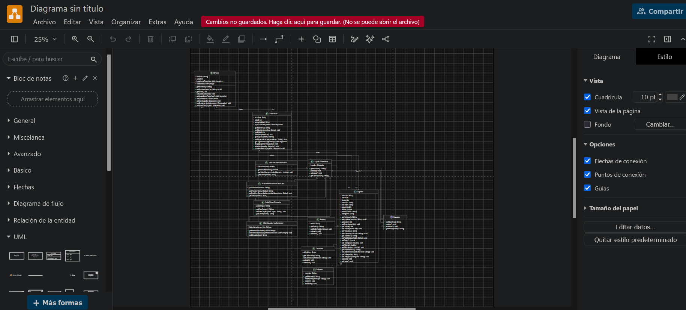
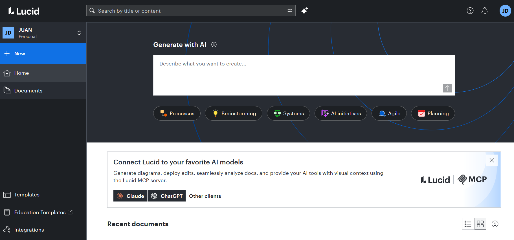
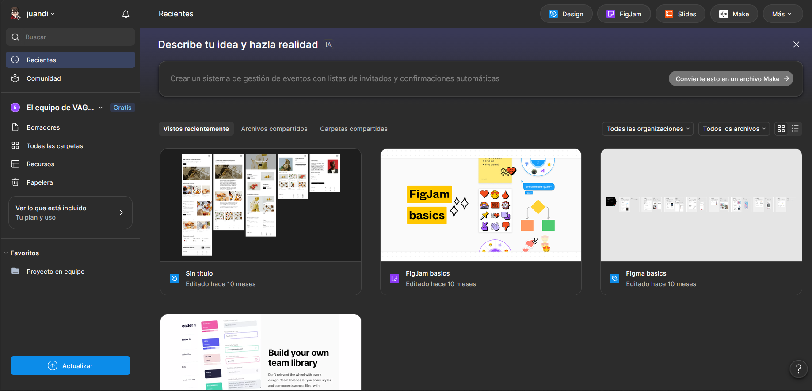
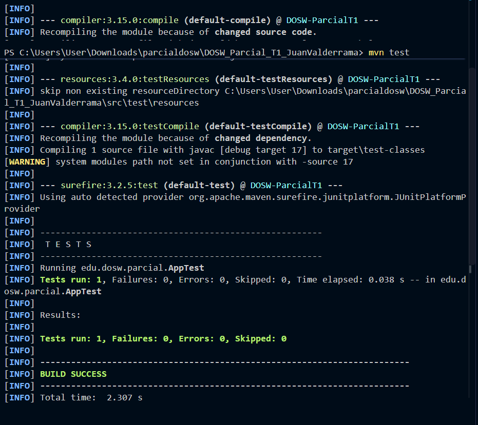

# DOSW_Parcial_T1_JuanValderrama

- Nombre completo: Juan Valderrama
- Grupo DOSW: 1
- Nombre del enunciado: [Espacio para el nombre del enunciado]
- Bitacora: https://github.com/juandivg26/BitacoraDOSW.git

## Requisitos previos

- Repositorio GitHub con nombre: DOSW_Parcial_T1_JuanValderrama
- Rama creada: `develop`
- Profesor agregado como colaborador

## Evidencias de acceso a herramientas

### Herramienta de modelado

- [x] Lucidchart / Draw.io / Miro: adjunte captura de pantalla de sesión activa o acceso a la cuenta.
draw.io

lucid

### Figma

- [x] Figma: adjunte captura de pantalla de acceso a la cuenta.

### Evidencia de Maven

- [x] Captura o evidencia de que el proyecto se ejecuta correctamente con Maven.

